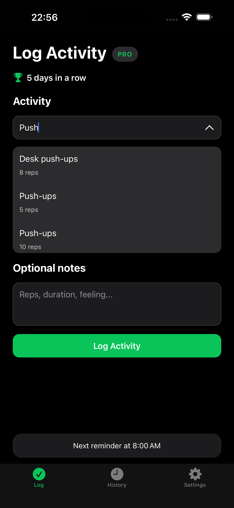
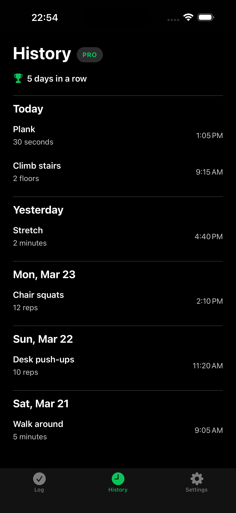
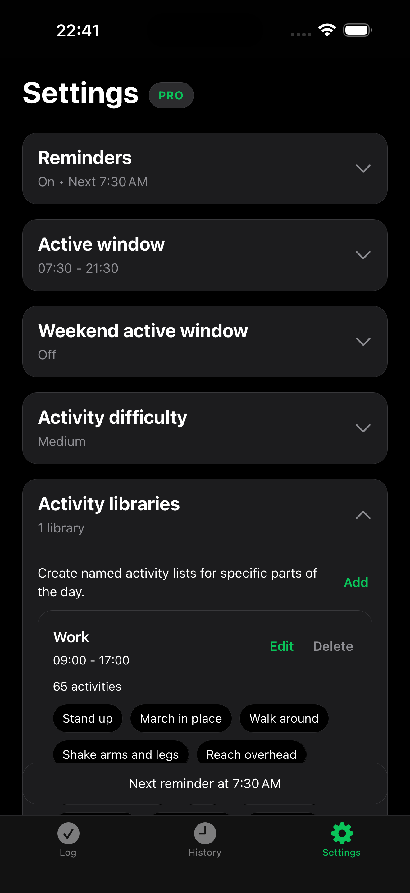
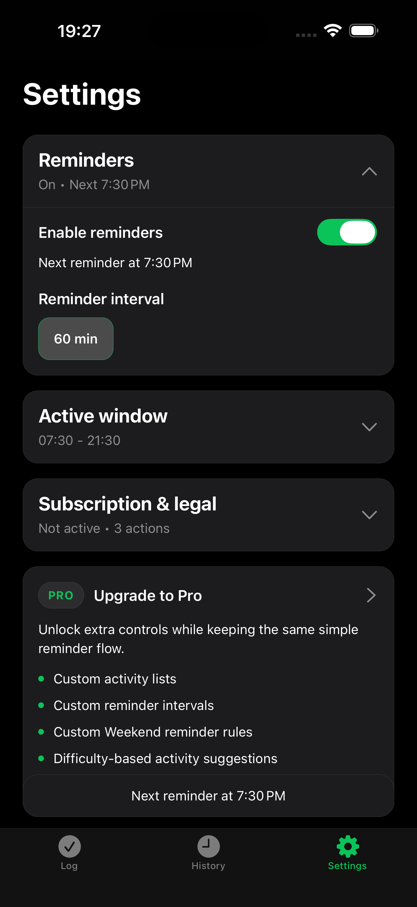

# Little Moves

Gentle reminders to move. Quick activity logging. A simple daily streak.

Little Moves helps you break up long sitting periods without the clutter of a traditional fitness app. It is built for people who want a lightweight log-and-reminder tool instead of workout programs, dashboards, or social features.

## Navigation

- [Support](https://rosucosmin96.github.io/little-moves-pages/support)
- [Privacy Policy](https://rosucosmin96.github.io/little-moves-pages/privacy-policy)
- [Terms of Use](https://rosucosmin96.github.io/little-moves-pages/terms-of-use)

## What You Can Do

- Log a small activity in seconds
- Add optional details like reps, minutes, or distance
- Receive gentle reminders during your active hours
- Review your activity history grouped by day
- Keep a simple daily streak going

## Why Little Moves

Little Moves is designed to stay quiet and practical:

- No account required
- No complicated setup
- No social feed or coaching program
- Your history stays on your device

## App Screenshots

### Log Screen

### History Screen

### Settings Screen

### Pro Features

## Support And Legal

- [Support](https://rosucosmin96.github.io/little-moves-pages/support)
- [Privacy Policy](https://rosucosmin96.github.io/little-moves-pages/privacy-policy)
- [Terms of Use](https://rosucosmin96.github.io/little-moves-pages/terms-of-use)

## Contact

For support questions, email **crosu.office@gmail.com**.
